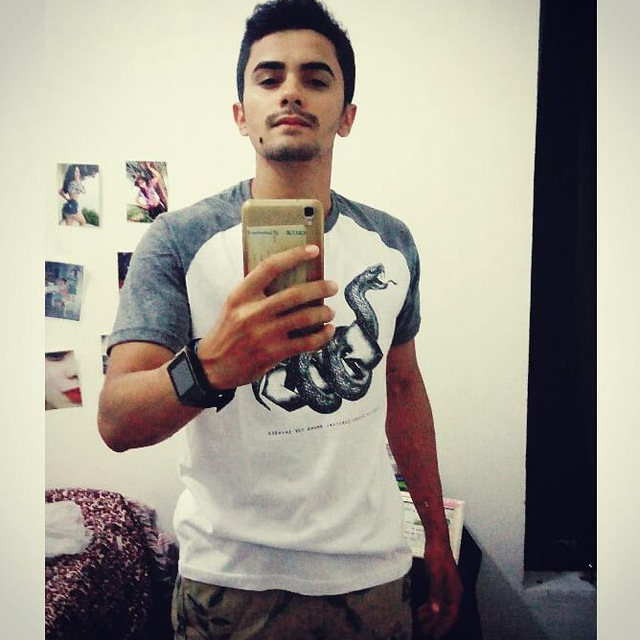

# RealTrack Brasil - Programacao-web

Repositório para disciplina de Programação WEB - UFS

  

# Sumário
1. [Sobre o projeto :moneybag:](#realtrack-brasil-moneybag)
2. [Telas :framed_picture:](#telas-framed_picture)
3. [Tecnoloagias utilizadas :desktop_computer:](#linguagens-e-ferramentas-utilizadas-no-projeto-desktop_computer)
4. [Referências e agradecimentos :fist_right: :fist_left:](#colaboradores-fist_right-fist_left)

# [RealTrack Brasil :moneybag:](https://realtrackbrasil.netlify.app/publica/entrar)

[RealTrack Brasil](https://realtrackbrasil.netlify.app/publica/entrar) é uma SPA *(Single Page Applications)* que organiza e apresenta de forma intuitiva registros diários das quantidades de cédulas e moedas em circulação em todo Brasil *(não estão incluídas as moedas comemorativas)* . Os dados são coletados diariamente pelo [Banco Central Do Brasil](https://dadosabertos.bcb.gov.br/dataset/dinheiro-em-circulao) e disponibilizados de forma gratuita.

O **RealTrack Brasil** surgiu como um projeto da disciplina Programação para WEB, ofertada pelo [departamento de computação](https://www.sigaa.ufs.br/sigaa/public/departamento/portal.jsf?id=83) da [Universisdade Federal de Sergipe](https://www.ufs.br/) (UFS). Sendo assim, os recursos utilizados para tornar a aplicação disponível está inteiramente ligado à instituição por meio do [AWS Academy](https://aws.amazon.com/pt/training/awsacademy/). Ou seja, ao finalizarmos a disciplina o projeto pode não está mais disponível *(no ar)*.

# Telas :framed_picture:

<figure>
  
  <figcaption>Tela de login</figcaption>
</figure>
<figure>
  
  <figcaption>Tela de cadastro</figcaption>
</figure>
<figure>
  
  <figcaption>Dashboard integrado com Google Analytics</figcaption>
</figure>
<figure>
  
  <figcaption>Dashboard listagem quantidade</figcaption>
</figure>

# Linguagens e Ferramentas utilizadas no projeto :desktop_computer:

<code></code>
<code></code>
<code></code>
<code></code>
<code></code>
<code></code>
<code></code>
<code></code>
<code></code>
<code></code>
<code></code>
<code></code>
<code></code>
<code></code>

# Referências e agradecimentos :fist_right: :fist_left:

Agradecemos às seguintes pessoas e instituições que contribuíram para este projeto:

<table>
  <tr>
    <td align="center">
      <a href="https://github.com/kaellandrade">
         
        
          <b>Micael Andrade</b>
        
      </a>
    </td>
    <td align="center">
      <a href="https://github.com/biel0209">
         
        
          <b>Marcus</b>
        
      </a>
    </td>
    <td align="center">
      <a href="https://github.com/gabrielbtera">
         
        
          <b>Gabriel</b>
        
      </a>
    </td>
     <td align="center">
      <a href="http://buscatextual.cnpq.br/buscatextual/visualizacv.do;jsessionid=760F40180C4CAB2DE0BDAD3625E66A33.buscatextual_0">
         
        
          <b>Glauco (Professor)</b>
        
      </a>
    </td>
  </tr>
</table>

- [Banco central](https://dadosabertos.bcb.gov.br/dataset/dinheiro-em-circulao)
- [Universidade Federal de Sergipe](https://www.ufs.br/)
---
[⬆ Voltar ao topo](#sumário) 
